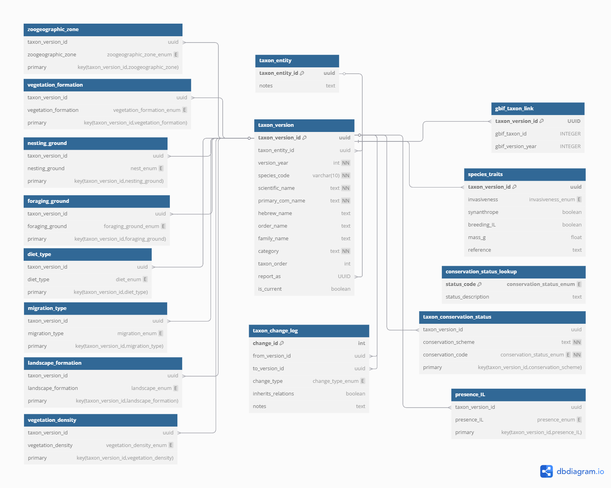

# README: Hamaarag Biodiversity Database

## Overview

This repository contains the schema, loading scripts, and documentation for Hamaarag's national biodiversity monitoring database. It is designed to store taxonomic versions, trait data, conservation statuses, structured ecological attributes, and monitoring data for species observed in Israel.

The database is implemented in **PostgreSQL**, tested locally in **pgAdmin**, and also deployed to a **Google Cloud SQL** instance (access instructions not included).

The current proof of concept implementation focuses exclusively on **bird observations**. Future versions will extend the schema to include other taxonomic groups.

## Documentation Structure

The documentation is organized into three main files:

1. **README.md** (this file) - High-level overview and project information
2. **SCHEMA.md** - Comprehensive schema reference with detailed table and field descriptions
3. **IMPLEMENTATION.md** - Setup instructions, data loading procedures, and query examples

## Requirements

This database was designed to fulfill the following core requirements:

1. **Support taxonomic versioning**: Represent species and higher taxa in a way that preserves historical taxonomic views and enables change tracking across time.
2. **Model structured trait data**: Store scalar, boolean, and multivalued ecological and biological traits for each species version.
3. **Track conservation statuses under multiple schemes**: Support IUCN, national, and future regional conservation systems.
4. **Normalize data while supporting flexibility**: Achieve at least Third Normal Form (3NF), with support for many-to-many relationships and complex trait mapping.
5. **Enable automation and data quality checks**: Support future integration with automated validation, reporting, and syncing systems.
6. **Ensure modular, scalable schema design**: Allow addition of new trait types, taxonomic layers, and references with minimal disruption.
7. **Enable reproducible data loading workflows**: Leverage R with `renv` for scripted trait and taxonomy ingestion.
8. **Support both local and cloud deployment**: Deployable via pgAdmin and mirrored on Google Cloud SQL.

### Tools and Infrastructure

* **PostgreSQL** (version unspecified)
* **pgAdmin** for local database interaction
* **R** (with package dependencies managed via `renv`)
* **dbdiagram.io** (used for schema modeling)

## Design Considerations

### 1. Data Normalization and Relational Structure

The database schema adheres to the principles of **Third Normal Form (3NF)**. This means:

* All fields are atomic (1NF)
* All non-key fields depend fully on the primary key (2NF)
* No non-key fields depend on other non-key fields (3NF)

The schema is designed to minimize data redundancy and enforce integrity through the use of foreign key constraints and strongly typed columns. Each logical concept (e.g., taxon identity, versioning, traits, presence types) is separated into its own table.

Multivalued attributes (e.g., species foraging in multiple habitats) are handled through **link tables** with composite primary keys. This preserves normalization while allowing for efficient joins and flexible filtering.

All categorical fields that represent closed, standardized sets of values (e.g., migration type, presence type, diet type) are normalized using PostgreSQL **ENUM types**, which are defined once and reused consistently across the schema. In cases where user-facing descriptions are needed (e.g., conservation status), a separate lookup table maps ENUM values to labels.The database follows a normalized relational model to reduce redundancy and improve data integrity. Many-to-many relationships (e.g., species associated with multiple foraging habitats) are handled via separate **link tables**. This enables efficient querying while maintaining flexibility for trait updates or expansions.

### 2. Taxonomic Versioning

A dual-structure approach is used for taxonomy:

* `taxon_entity`: Stores the stable identifier for a species or taxon concept, independent of time.
* `taxon_version`: Stores the versioned, year-specific representation of that taxon, including names, categories, and identifiers.
  This separation allows full traceability of taxonomic changes over time, supports longitudinal analyses, and facilitates "reporting as" logic via the `report_as` field.
* `taxon_change_log`: Records explicit taxonomic changes between versions, such as splits, lumps, renames, additions, or deprecations. Each row documents a directional relationship between two `taxon_version` records along with a `change_type`, enabling historical traceability, lineage reconstruction, and formal modeling of taxonomic evolution across time.
* `gbif_taxon_link`: Associates each `taxon_version` with a corresponding GBIF taxon identifier. This provides an external reference for interoperability with global biodiversity datasets and supports integration with GBIF-mediated occurrence records, traits, and classification systems.

### 3. Use of ENUM Types

Key categorical fields use **PostgreSQL ENUM types** (e.g., `migration_enum`, `presence_enum`, `conservation_status_enum`, `habitat_type_enum`). This provides:

* Strong value constraints at the database level
* Better query performance compared to joined lookup tables
* Simplified client-side code (e.g., form validation or filters)

For fields requiring human-readable descriptions (e.g., conservation status, weather descriptions), ENUM codes or standardized codes are joined to small **lookup tables** for label resolution.

### 4. Trait Modularity

Species traits are split into:

* A core table `species_traits` for scalar and boolean fields
* Multiple link tables for multivalued categorical traits (e.g., foraging\_ground, nesting\_ground)
  Each trait is linked by `taxon_version_id`, allowing traits to vary across taxonomy versions and supporting rollback or reassignment.

### 5. Conservation Status Schema

The conservation model supports multiple schemes (e.g., Global/IUCN, National Red List) via the `taxon_conservation_status` table. Each row includes:

* A taxon version reference
* A scheme identifier (text)
* A status code (ENUM)
  This design allows coexistence of multiple assessments per species and ensures consistent auditing of changes over time.

### 6. Monitoring Hierarchy

The monitoring module follows a hierarchical organization:

* `monitoring_unit`: Top-level unit (e.g., "Mediterranean Maquis", "Arid South")
* `monitoring_site`: Site within a unit (e.g., "Ashalim", "Kfar Shamai")
* `monitoring_point`: Specific sampling point with geo-coordinates

This structure enables flexible grouping of monitoring activities while maintaining geographic context.

### 7. Observation Structure

The observation model connects monitoring events with taxonomy:

* `monitoring_campaign`: Represents a monitoring campaign with start/end years
* `monitoring_event`: Records a specific monitoring event at a point and time
* `species_observation`: Documents species observed during events with detailed count data
* `species_breeding_relationship`: Documents breeding status at monitoring units

The `first_five_mins` boolean field in species observations enables standardized analysis of detection timing, while the distance bands (0-20m, 20-100m, etc.) support density and abundance calculations.

## Implementation Steps

* Schema designed and visualized in `dbdiagram.io`
* SQL DDL written and tested in pgAdmin
* ENUM types created for all categorical fields
* Core tables implemented with referential integrity
* Lookup tables (e.g., `conservation_status_lookup`, `weather_description_lookup`) seeded via SQL
* Data loading scripts developed in R (`load_traits.R`) and Python (`load_monitoring_data.py`)
* Full schema deployed to local PostgreSQL and replicated to Google Cloud SQL
* Documentation updated to reflect schema changes

## Future Work

* Integration with **Fulcrum** and **Survey123** for direct syncing from field collection tools
* Internal **dashboard** development for data review, summary reports, and **spatial queries**
* **Automated workflows**:
  * Periodic report generation
  * Email-based validation requests for flagged records
* Seeding and linking **GBIF taxon IDs** (`gbif_taxon_link` table)
* Support for **image and media uploads** (e.g., photo evidence for records)
* Optional **PostGIS** support for spatial fields (e.g., range maps, observation polygons)
* Building a **query API layer** for filtered and authenticated access
* **Testing framework**: Establish data and schema validation procedures with versioned test cases
* **Expanded taxonomic coverage**: Add schemas and data for plants, arthropods, reptiles, and mammals

